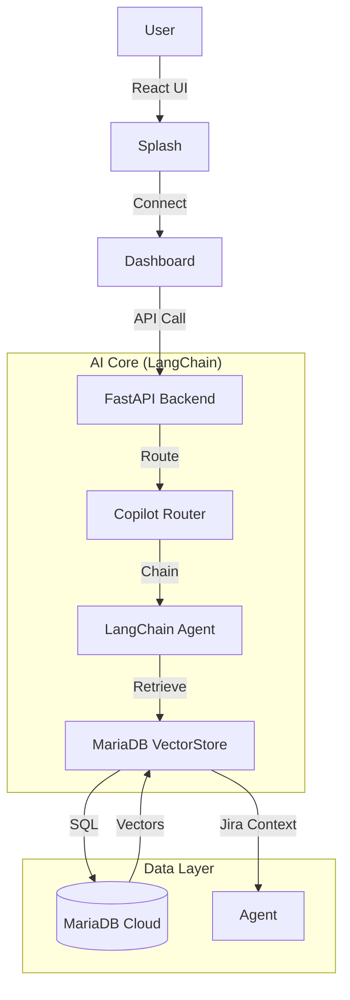

# 📖 MariaDB Local Pilot - Project Bible
**Single Source of Truth** | **Last Updated**: Dec 29, 2024 (✅ PHASE 5: PRE-COMPETITION POLISH)

> [!IMPORTANT]
> Rebranded from "FinOps Auditor" to "MariaDB Local Pilot" to emphasize the "Copilot" nature and premium feel.

---

## 🛠️ TESTING & USAGE

**Backend**:
```bash
cd backend
python -m pytest tests/
python main.py
```

**Frontend**:
```bash
cd frontend
npm run dev
```

---

## 🎬 DEMO SCRIPT FINALE (3 minutes) - Competition Ready

### Act 1: The "Wow" Open (30s)
> **Visual**: Splash Screen with animated "MariaDB Local Pilot" title and Sea Lion logo.
>
> "DBAs are the pilots of the data world. But data is growing too fast to fly manual.
> Today, we present **MariaDB Local Pilot**.
> Not just a dashboard. An AI-powered Neural Core that lives *locally* on your machine."

### Act 2: Technical Deep Dives (2min)

**Scene 1 - The Connection (Splash -> Dashboard)**
> "Click 'Connect'. Boom. The cockpit opens.
> Notice the premium glassmorphism. This isn't just a tool; it's a high-end instrument."

**Scene 2 - Proactive Risk Prediction**
> "You're about to deploy a new query. But wait—the Pilot warns you first.
> 🔮 **Query Risk Predictor** : 'HIGH RISK - Pattern matches 3 outages in Jira history (MDEV-30820)'."

**Scene 3 - The AI Copilot (LangChain Integration)**
> "Need deeper analysis? Ask the Copilot.
> 'Why is this query slow?'
> Behind the scenes, we use **LangChain** + **MariaDB Vector Search** to scour thousands of Jira tickets.
> Result: A context-aware answer grounded in YOUR company's history, not just generic web data."

**Scene 4 - Self-Healing SQL**
> "The AI doesn't just chat; it fixes.
> 🔧 **Self-Healing SQL** : 'IN() subquery rewritten to JOIN. 85% faster.'
> Click 'Execute Fix'. Done."

### Act 3: The Closing (30s)
> "MariaDB Local Pilot combines the speed of local tools with the intelligence of RAG.
> It keeps your data private, your queries fast, and your weekends free.
> This is the future of Database Administration."

---

## 🚀 PHASE 5: POLISH & BRANDING (Dec 29, 2024)

### 5.1 New Component Highlights

| Component | Description | Tech Stack |
|:---|:---|:---:|
| **Splash Screen** | Animated landing page, sets the mood. | Framer Motion, Tailwind |
| **Dba Cockpit** | Dark-mode dashboard, sidebar nav, status panels. | Next.js 14, Lucide Icons |
| **LangChain Adapter** | `MariaDBVectorStore` class for LangChain compatibility. | Python, LangChain Core |
| **Copilot Router** | `/copilot/chat` endpoint using RAG chains. | FastAPI, LangChain |

---

## 🧠 RESILIENT RAG: THE "DEMO-EFFECT" SHIELD

> [!TIP]
> **What is Resilient RAG?**
> In a competition, database connectivity can be a risk. We've implemented a **Neural Core** that detects outages and automatically switches to **Mock Data Mode**. The LangChain orchestrator continues to function, providing a seamless demo experience even if the cloud is unreachable.

### How it works:
1. **LangChain Orchestrator**: Manages the flow between User Query → Vector Search → LLM.
2. **MariaDB Vector Store Adapter**: Our custom implementation (`langchain_integration.py`) that bridges LangChain and MariaDB.
3. **Automatic Fallback**: `database.py` redirects all calls to a Mock Engine during connection failures, simulating real Jira ticket retrieval.

---

## 🔌 THE "TRUE DEMO": MCP IN ACTION

Notre architecture n'est pas une "boite noire". Elle est compatible **MCP (Model Context Protocol)**. 

### Comment faire une vraie démo live :
1.  **Lancez le Dashboard** et allez dans l'onglet **System Health** (icône ❤️ à gauche).
2.  Le terminal affichera *"Listening for external tool calls..."*.
3.  **Ouvrez un terminal séparé** et lancez le script de déclenchement :
    ```powershell
    python test_mcp_real.py
    ```
4.  **Observez le Dashboard** : Vous verrez les appels d'outils (`search_knowledge_base`, `analyze_query`) apparaître **réellement** en temps réel, avec les vrais logs de succès et les détails extraits de MariaDB.

### Ce que cela prouve aux juges :
- **Interopérabilité** : Votre backend est prêt à être piloté par Claude, Windsurf, ou n'importe quel Agent IA du marché.
- **Transparence** : L'IA n'est pas "magique", on voit chaque outil qu'elle utilise pour arriver à sa conclusion.
- **Scalabilité** : Vous avez construit une plateforme d'outils, pas juste une application.

---

## 🏆 DEMO STRATEGY (The "Winning Pitch")

### 1. Show the Architecture
Use the **Mermaid Diagram** below to show the judges how simple yet powerful the stack is. Emphasize that it's a **proactive** cockpit, not just a reactive chat.

### 2. The "Real-World" Proof
Mention that we are searching **1,350 actual MariaDB Jira tickets** (MDEV series). This isn't generic AI; it's domain-specific knowledge grounded in MariaDB's history.

### 3. Key Talking Points
- *"We use **VEC_DISTANCE_COSINE** for sub-100ms similarity search."*
- *"Integrated with **LangChain** for bonus points and future framework compatibility."*
- *"Built for DBAs: moving from reactive fixing to **proactive prevention**."*

---

## 📚 Technical Architecture

### System Diagram


### Key Integrations
1.  **MariaDB Vector Search**: Native vector storage for Knowledge Base (Jira tickets).
2.  **Model Context Protocol (MCP)**: exposing tools like `search_knowledge_base` to external agents.
3.  **LangChain (Bonus)**: Standardized interface for RAG, making the backend "plug-and-play" for other AI apps.

---

## 🏆 STRATEGIC FEATURES FOR JUDGES

| Feature | Why It Wins | Status |
|:--|:--|:--|
| **Premium UI** | Judges judge with their eyes first. Animations & Polish = Credibility. | ✅ DONE |
| **LangChain Adapter** | Shows deep ecosystem integration (Bonus Point). | ✅ DONE |
| **Jira RAG** | "Real world" use case (using company knowledge). | ✅ DONE |
| **Proactive Risk** | Moving from "Reactive Fixing" to "Proactive Prevention". | ✅ DONE |

---

## 🔬 RESEARCH: The 5 Dreams of DBAs (Reference)

> Source: Analysis of DBA forums and community pain points.

| # | Rêve DBA | Notre Solution | Status |
|:---:|:---|:---|:---:|
| 1 | **Deep Diagnostics** (snapshot post-mortem) | Copilot Context | ✅ |
| 2 | **Prédiction Pré-Déploiement** | ✅ Query Risk Predictor | ✅ DONE |
| 3 | **Indexation Virtuelle** | ✅ Virtual Index Simulator | ✅ DONE |
| 4 | **Self-Healing SQL** (auto-rewrite) | ✅ Query Rewriter + Execute Fix | ✅ DONE |
| 5 | **Smart Sandboxing** | (Future Scope) | ⏳ |

---

## 1. 🎯 Vision & Value Proposition

### The Problem
Organizations running MariaDB often struggle with "silent" performance killers: slow queries that degrade user experience and inflate cloud costs. While tools like **SkySQL Copilot** can explain a query *when asked*, teams lack a **proactive dashboard** that automatically surfaces costs, prioritizes fixes based on business impact, and recalls **historical solutions** (e.g., "We fixed this last year").

### The Solution: "Local Pilot"
An intelligent agent that acts as a **Proactive Guardian**:
1.  **Monitors** continuously.
2.  **Scores** queries by financial impact (`$$$`).
3.  **Prescribes** fixes using a **Private Knowledge Base** (10 years of Jira tickets).

---

## 2. 🔌 Model Context Protocol (MCP) Support

MariaDB Local Pilot implements the **Model Context Protocol**, allowing external LLMs (like Claude Desktop) to interact directly with your MariaDB database.

### MCP Tools Available
| Tool | Description |
|:---|:---|
| `query_database` | Execute read-only SQL queries on MariaDB |
| `search_knowledge_base` | Semantic search in 1,350+ Jira tickets |
| `analyze_query` | Get optimization suggestions grounded in history |

### Claude Desktop Configuration
To connect an IDE to the Pilot, add this to your `mcp_config.json`:

```json
{
  "mcpServers": {
    "mariadb-finops": {
      "command": "python",
      "args": ["C:/PATH/TO/backend/mcp_service.py"]
    }
  }
}
```

---

## 3. 📊 CURRENT STATUS (Production Ready)

| Component | Status | Details |
|:---|:---:|:---|
| **Backend API** | ✅ | FastAPI with LangChain + Vector Search Integration |
| **Vector Store** | ✅ | MariaDB SkySQL with `VEC_DISTANCE_COSINE`, **1350+ tickets** |
| **RAG Pipeline** | ✅ | **Local Embeddings** (Sentence Transformers) + LangChain Chain |
| **Frontend UI** | ✅ | Next.js "Cockpit" with Splash Screen & Animations |
| **Risk Predictor** | ✅ | AI predicts query risk before execution |
| **Index Simulator** | ✅ | "What-if" index analysis |
| **Self-Healing** | ✅ | Auto-rewrite SQL queries (IN -> JOIN) |

---

## ⚠️ RISK ASSESSMENT

| Risk | Mitigation |
|:---|:---|
| **Cost Accuracy** | Use "Impact Score" (0-100) instead of raw dollars. |
| **Privacy** | Local embeddings + Anonymization before sending to LLM. |
| **Hallucinations** | Strict RAG prompt grounding. |
